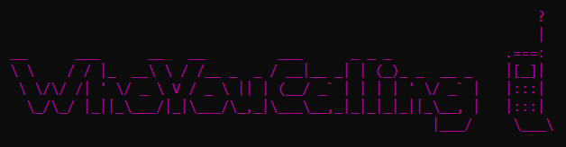

Reviews the network activity made by an executable through the use of Windows Event Tracing (ETW) and by Full Packet Capture that's subjected to BPF filtering based on the detected network activity made by the process. 

## Features: 
- Can execute a binary and records all the network activity or listen to already running process
- Records TCPIP activities made by a processes (IPv4, IPv6 and localhost)
- Creates a fullpacket capture pcap file per process
- Records DNS requests made by applications
- Can be automated with a specified timer to monitor network activites
- Can ensure all monitoring is applied to all spawned child processes from the origintating executable.
- Results can be exported to JSON

## Usage:
(*Must be run as administrator - for packet capture and listening to the ETW*) 

**Execute a binary with arguments and track all child processes made by it. Output the results to a folder on the user desktop**:
`WhoYouCalling.exe -e C:\Users\Desktop\TestApplication.exe -a "--pass=ETph0n3H0m3" -f -i 4 -o C:\Users\H4NM\Desktop`

**Listen to process with PID 1337 and output the results to json. Skip FPC (Which will only log the ETW activity)**:
`WhoYouCalling.exe --pid 1337 --nopcap --json --output C:\Users\H4NM\AppData\Local\Temp`

**Run sus.exe for 60 seconds and monitor all the child processes with FPC on the 8th enumerated interface. When the timer expires, kill all tracked pprocesses - including child processes**:
`WhoYouCalling.exe -e C:\Users\H4NM\Desktop\sus.exe -f -t 60 -k -i 8 -o C:\Users\H4NM\Desktop`

### Example results

### To do:
- [ ] Sort the output addresses
- [ ] Console write when process start and finish. 
- [ ] Only create a results folder for processes that has any data within them.