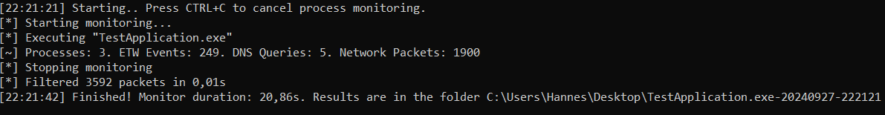
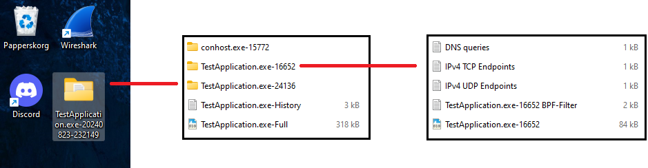

# WhoYouCalling 

Monitors network activity made by a process through the use of [Windows Event Tracing (ETW)](https://learn.microsoft.com/en-us/windows-hardware/drivers/devtest/event-tracing-for-windows--etw-) and Full Packet Capture (FPC). Filters a generated .pcap file with BPF filtering based on the detected network activity made by processes. 
This application makes process network monitoring hella' easy.

  
"Why not just use ProcMon+Wireshark??"🤔🤔

One of the best methods of monitoring activities by a process in Windows is with the Sysinternal tool [ProcMon](https://learn.microsoft.com/sv-se/sysinternals/downloads/procmon). 
However, there are some downsides:
1. **Manual Work**: To get a Full Packet Capture per process you need to manually start a packet capture with a tool like Wireshark/Tshark, and create a filter for endpoints based on the results of ProcMon, which can be timeconsuming and potential endpoints may be missed due to human error of the process is not automated.
2. **Child processes**: It can be tedious to maintain a track record of all of the child processes that may spawn and the endpoints they're communicating with
3. **DNS queries**: (AFAIK) ProcMon doesn't support capturing DNS queries. It does enable provide with UDP Send to port 53, but no information of the actual domain name that's queried. 

## Features: 
- Can execute a binary and records all the network activity or listen to already running process
- Records TCPIP activities made by a processes (IPv4, IPv6 and localhost)
- Creates a fullpacket capture .pcap file per process
- Records DNS requests made by applications
- Can apply strict filtering to .pcap to only record TCPIP activity being sent from the process
- Can be automated with a specified timer to monitor network activites
- Can ensure all monitoring is applied to all spawned child processes from the origintating executable.
- Results can be exported to JSON

## Usage:
(*Must be run as administrator - for packet capture and listening to the ETW*) 

**Execute a binary with arguments and track all child processes made by it. Output the results to a folder on the user desktop**:
`WhoYouCalling.exe -e C:\Users\Desktop\TestApplication.exe -a "--pass=ETph0n3H0m3" -f -i 4 -o C:\Users\H4NM\Desktop`

**Listen to process with PID 1337 and output the results to json. Skip FPC (Which will only log the ETW activity)**:
`WhoYouCalling.exe --pid 1337 --nopcap --json --output C:\Users\H4NM\AppData\Local\Temp`

**Run sus.exe for 60 seconds and monitor all the child processes with FPC on the 8th enumerated interface. When the timer expires, kill all tracked pprocesses - including child processes**:
`WhoYouCalling.exe -e C:\Users\H4NM\Desktop\sus.exe -f -t 60 -k -i 8 -o C:\Users\H4NM\Desktop`
	
### Example results

### To Do:
- [ ] Add resolved IP for domainname
  - [ ] **Work in progress**: Note to self, CatalogETWActivity needs to make proper lookups for DNS attributes and to log the event accordingly. Afterwards, ensure proper output to file
- [ ] Create Wireshark filter in addition to BPF filter
- [ ] Add flag to capture every process with the same executable name rather than following a chain of PIDs. 
  -  Noticed in the execution of firefox where it called a seperate process (explorer.exe) to start firefox. This is missed by --fulltracking. 
